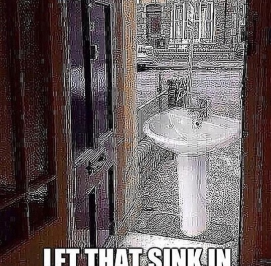
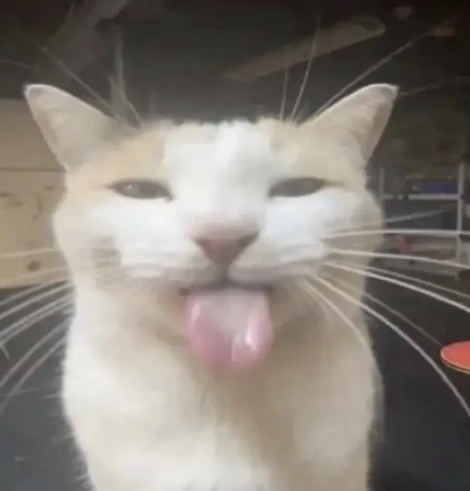
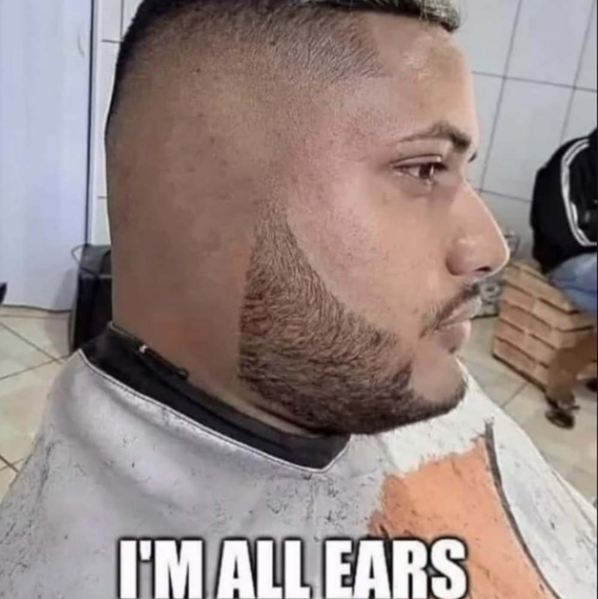
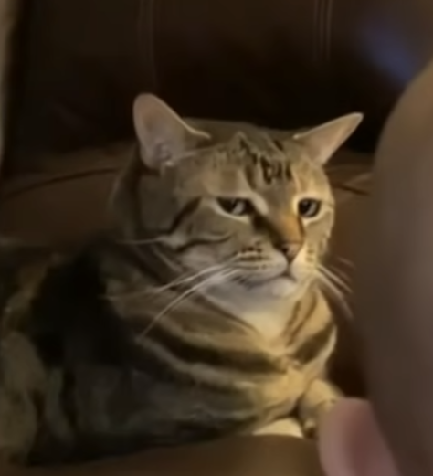

<!--### Hello! 👋

I'm a software developer with an interest in cyber security. I'm currently working on "Get Outside", a disability-friendly location index. This is currently a secret project as I'm working on it for my coursework at university.

The technologies that I'm well versed in are:

- Java
- Kotlin
  - Android + Jetpack Compose
- TypeScript
- Angular
- PostgreSQL

I enjoy experimenting with different languages and software - I'm currently trying out Fedora Linux on my laptop.-->

<!--
**the-wright-jamie/the-wright-jamie** is a ✨ _special_ ✨ repository because its `README.md` (this file) appears on your GitHub profile.

Here are some ideas to get you started:

- 🔭 I’m currently working on ...
- 🌱 I’m currently learning ...
- 👯 I’m looking to collaborate on ...
- 🤔 I’m looking for help with ...
- 💬 Ask me about ...
- 📫 How to reach me: ...
- 😄 Pronouns: ...
- ⚡ Fun fact: ...
-->
