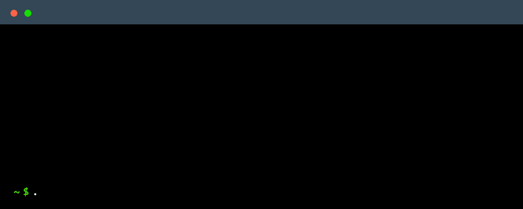

  

                            

 

### A bit about me

I enjoy programming in my spare time and I do security work in my day job. I'm well versed in many programming languages as well as technologies (most of which have been listed in the badges above): some have been picked up from my job, some picked up out of necessity (to fulfil niche bespoke coding requests for example) and some picked up in academia for coursework projects. I have been programming since ~2015, and today I am able to pick up new languages quickly and as needed.

I also enjoy learning, [experimenting](https://xsfs.xyz/article?title=bait-and-switch&year=2023) and sharing knowledge. [I have a blog](https://xsfs.xyz/) that I occasionally write for to share some of the knowledge I have acquired, and at work I often lead a Cyber Security workshop for work experience students.

I have experience with the three major operating systems, Linux; Windows and macOS.

If you'd like to know more and read a fully in-depth about me, you can [visit my personal website](https://the-wright-jamie.dev/).

 Extra Stats 

 

<h4> Development (& other) Machines </h4>

   

