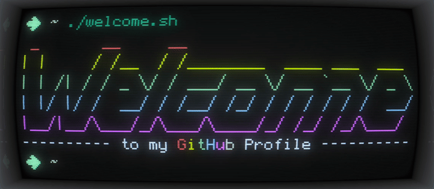

# Heya, I'm Jamie!

       

I like to dabble in lots of different things. My profile is mostly a graveyard of discontinued experiments 😁 I'm currently interested in Systems Design, learning about how we can sustainably architect software in a way that supports future development while still allowing rapid prototyping and MVP deliverables. That's a nice little bit of management speak, isn't it? Succinctly sums up my goal though.

I love details and technicalities, I think the theory of things can help us understand the problems we face and lead to the development of better ideas. Especially as AI interrupts our industry, the core understanding of what we are doing here is going to be more and more key to SWE's future.

Feel free to check out my highlights below, as well as my [portfolio website](https://the-wright-jamie.dev/). If you want to get in touch, feel free to use the email linked on the right.
