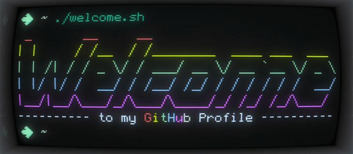

Generated by using <a href="https://github.com/Swordfish90/cool-retro-term">Cool Retro Term</a> and <a href="https://github.com/FFmpeg/FFmpeg">ffmpeg</a>

<h4>Time in IDEs</h4>

<h4>Technologies worked with</h4>

These are all the software technologies I have worked with over my time, but does not reflect my ability with individual technologies.

|     Domain     | Technologies                                                                                                                                                                                                                                                                                                                                                                                                                                                                                                                      |
| :------------: | --------------------------------------------------------------------------------------------------------------------------------------------------------------------------------------------------------------------------------------------------------------------------------------------------------------------------------------------------------------------------------------------------------------------------------------------------------------------------------------------------------------------------------- |
|    General     |                                                                                        |
|     Mobile     |                                                                                                                                                                                                                                                                        |
|      Web       |       |
|   Databases    |                                                                                                                                                                                                                                                                    |
|      OSes      |                                                                                                                                                                                                                                                                          |
|      IDEs      |                                                                                                                                                                                                                                        |
| Infrastructure |                                                                                                                                                                                                                                                                 |
| Security |     |

<h4> Current Machines </h4>

   

 

### A bit about me

I enjoy programming in my spare time and I do security work in my day job. I'm well versed in many programming languages as well as technologies (most of which have been listed in the badges above): some have been picked up from my job, some picked up out of necessity (to fulfill niche bespoke coding requests for example) and some picked up in academia for coursework projects. I have been programming since ~2015, and today I am able to pick up new languages quickly and as needed.

I think open-source is awesome. Where possible, I endeavor to make any little or big projects I create available on this account. I'm also always looking for ways to contribute to other projects as well. Of course, life is busy, so I don't get to do an awful lot. But I like to contribute where possible.

I also enjoy learning, [experimenting](https://xsfs.xyz/articles/2023/bait-and-switch), and sharing knowledge. [I have a blog](https://xsfs.xyz/) that I occasionally write to share some of the knowledge I have acquired, and at work I often lead a Cyber Security workshop for work experience students.

I have experience with the three major operating systems, Linux; Windows, and macOS.

If you'd like to know more and read a full in-depth about me, you can [visit my personal website](https://the-wright-jamie.dev/).

 (Recorded) Time Spent on Public Projects 

 

| Project | Time                                            |
| :---: | ------------------------------------------------------ |
|  [Tab Nine](https://github.com/the-wright-jamie/tab-nine)   |  |
|  [depcheck-json-parser](https://github.com/the-wright-jamie/depcheck-json-parser)   |       |
| [overwatch](https://github.com/the-wright-jamie/overwatch) (not yet released) |  |

 What do the emoji's beside my commits mean? 

 

| Emoji | Description                                            |
| :---: | ------------------------------------------------------ |
|  ✨   | Additions to the code, such as new features or methods |
|  🔧   | Change to a feature's behavior or bug fix, full or partial |
|  📂   | Moving of code to different folders |
|  💣   | Commit is broken and may not build                     |
|  🗑️   | Removal of code, such as obsolete methods or variables |

